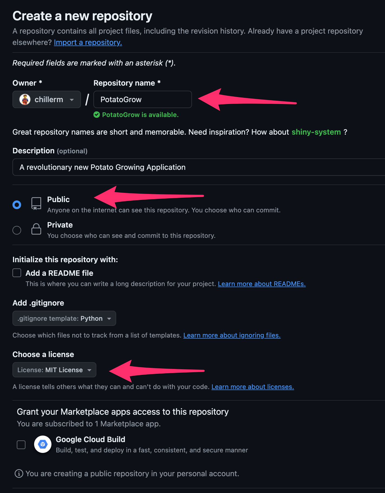
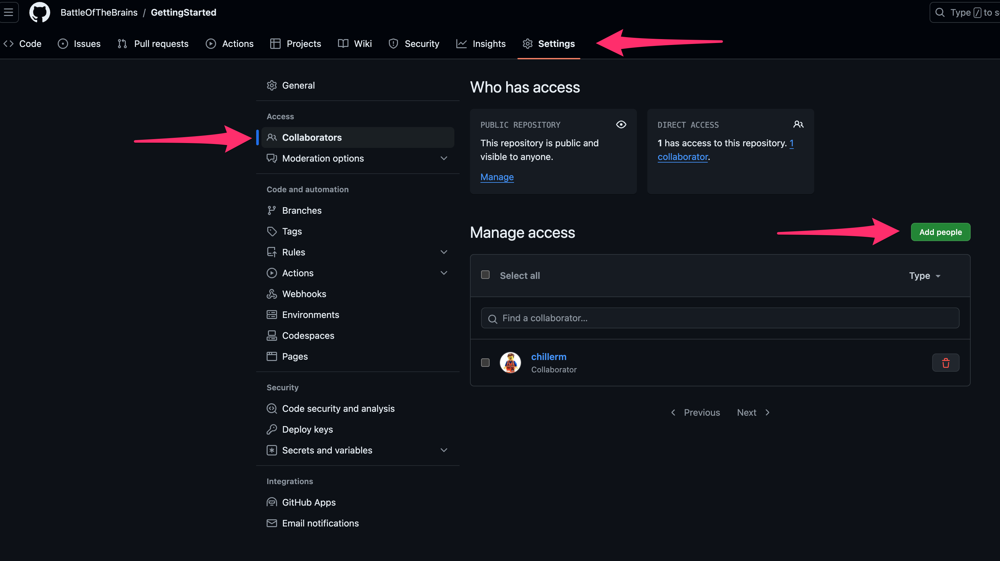
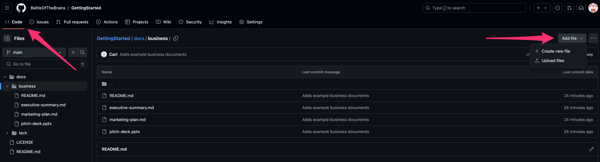
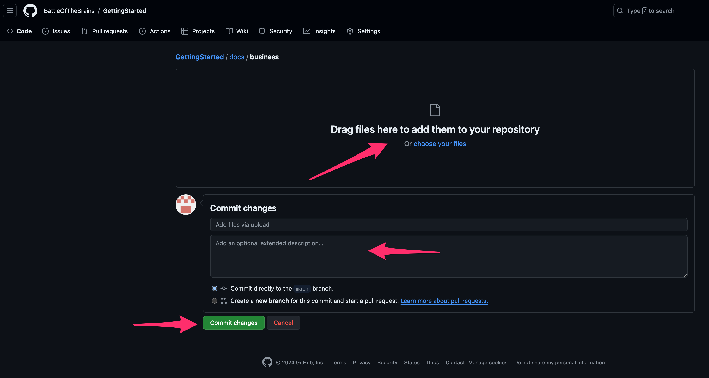

- [Getting Started](#getting-started)
- [GitHub Repository](#github-repository)
  - [Creating a GitHub Repository](#creating-a-github-repository)
  - [Adding documents/files to a repository (business)](#adding-documentsfiles-to-a-repository-business)
  - [Cloning and pushing to a repository (tech)](#cloning-and-pushing-to-a-repository-tech)
- [Repository Setup](#repository-setup)
  - [Repository Structure](#repository-structure)
  - [Repository README](#repository-readme)

# Getting Started

The purpose of this repository is to explain how to create a repository that will be used to submit your application deliverables for the Battle of the Brains contest.

# GitHub Repository

Github will be used to work on and deliver your application and related documentation.

## Creating a GitHub Repository

- Create a free GitHub account using an email of your choice, or use an existing GitHub account.

- Create a new public repository
  - **NOTE:** Ther person who creates the repository will be the admin and responsible for other tasks like granting access to other team members.
  - Once you have signed into [GitHub](https://github.com) you can create a new repository by navigating to https://github.com/new.
    1. Choose a name representative of your team/application
    2. Ensure the repository is public
    3. Select an appropriate license (MIT license should suffice)

    <details>
    <summary>Example</summary>

    
    </details>

  - Add team members as collaborators
    1. In your repository, select the "Settings" tab
    2. On the left Nav, select "Collaborators"
    3. Select "Add People"
    4. Add each team member by username, full name, or email

    <details>
    <summary>Example</summary>

    
    </details>

## Adding documents/files to a repository (business)

- To add files to a repository without using git/gh commandline, you can use the GitHub web interface.
  1. Navigate to your repository
  2. Select the "Add file" dropdown
  3. Choose "Upload files"
  4. Drag and drop files or select files from your computer
  5. Add a commit message and select "Commit changes"
  <details>
  <summary>Example</summary>

  

  
  </details>

## Cloning and pushing to a repository (tech)

- It is recommended to use the [GitHub CLI](https://cli.github.com/) to interact with GitHub

- Authenticate to Github using the `gh auth login` command

- At this point, you should be able to follow the regular `git add`, `git commit`, and `git push` workflow

# Repository Setup

## Repository Structure

Below is a suggested structure for your repository to help organize your deliverables.

- 📁 **root**
  - 📁 **[docs](./docs/)**
    - 📁 **[business](./docs/business/)**
      - 📄 [README.md](./docs/business/README.md)
      - 📄 [executive-summary.md](./docs/business/executive-summary.md)
      - 📄 [marketing-plan.md](./docs/business/marketing-plan.md)
      - 📄 [pitch-deck.pptx](./docs/business/pitch-deck.pptx)
    - 📁 **[tech](./docs/tech/)**
      - 📄 [README.md](./docs/tech/README.md)
  - 📁 **src**
    - 📄 `myapp.py`
  - 📄 `Dockerfile`
  - 📄 `run.sh`

## Repository README

- Your repository README must be well-documented and organized. This will be the first thing judges see when they visit your repository.
- At a minimum, you should include:
  - How to get to business deliverable documents
  - What your application does
    - What tech/frameworks does it use
    - What the judge should do to navigate/interpret your application
  - How to run your application
    - It is recommended to Dockerize your application
    - Regardless of the steps needed to build/run your application, it is recommended you script all the build/run steps in a `run.sh` script in the main folder
  - A way to tell if the app started successfully
    <details>
    <summary>Example</summary>

      ```bash
      ./run.sh
      Building Image...
      0d2ccda6bc78bf764467f2a9b025c12e221891eba035dc3a61bde7fedf06525b
      Started potato-grow:0.0.1...
      Waiting for startup
      Running an example curl to check app is working
      {
        "estimated_yield": 0,
        "growth_stage": "planting",
        "health_status": "healthy"
      }
    ```
    </details>


**Remember the easier it is to build/run/interpret your application, the better your chances of winning!**
